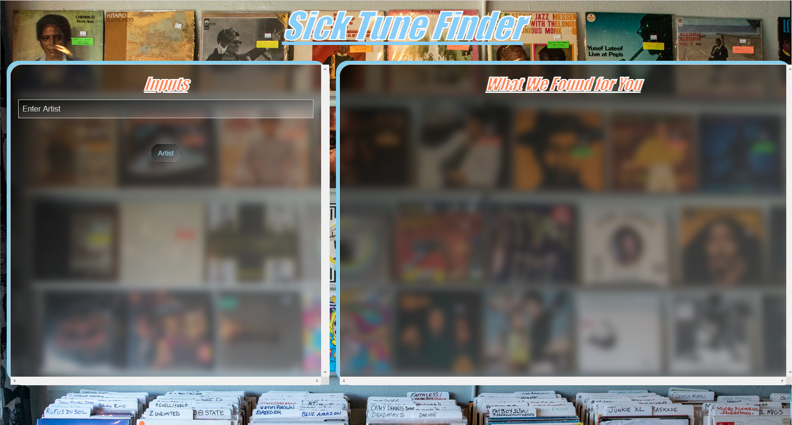
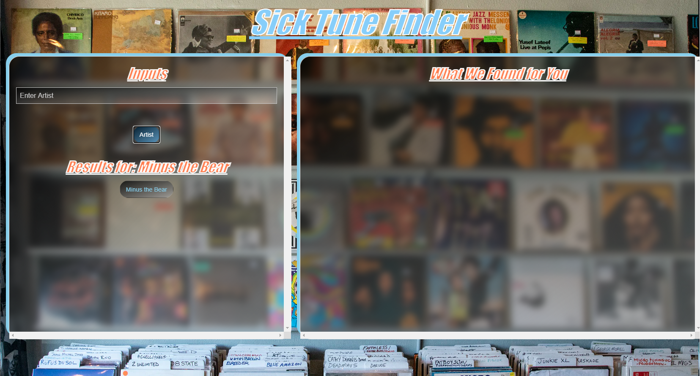
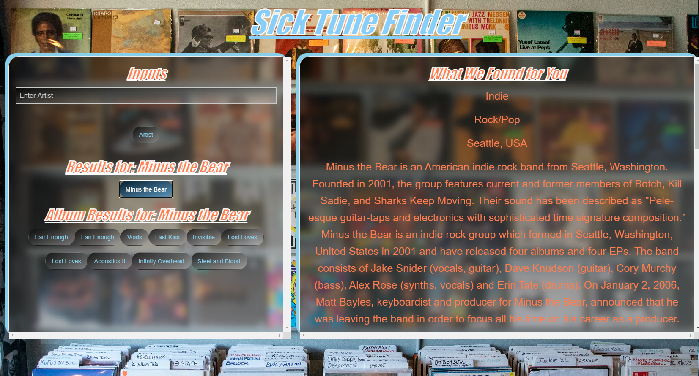
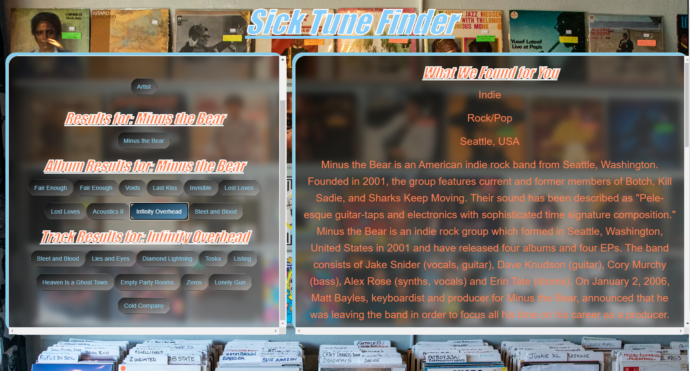
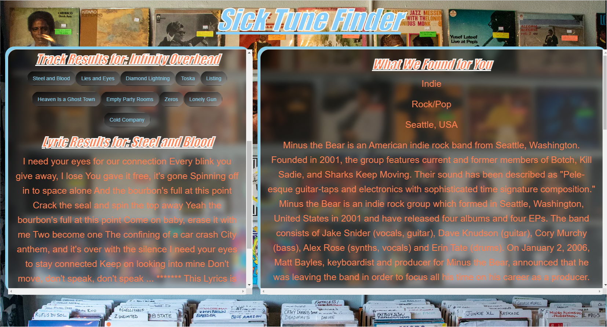

# Project Name "SICK TUNE FINDER"
- The purpose of this project is to create an application that allows the user to search for an Artist, Album, and Song information.
- Everything starts with the artist (Band Name) and drills down from there rendering available albums, track listings, lyrics and artist biographical information.

# Step 1. Start with the Artist (Band Name) search
- type your search text into the input box and hit the enter key or click on the "Artist" button
- this search will generate buttons for available artist with the search term in it for further drill down.
- Generally, this works perfectly.
    + in some cases, searching for a portion of an artist name will not return the target artist. 
    + Example: searching for non or point does NOT return nonpoint.

# Step 2. Select the artist from the selection available.
- If artist buttons are NOT created try the artist search again using more word, less words, or different words.
- Clicking on an artist button will generate the available albums and create buttons for further drill down.
- Clicking on the artist generate the subgenre, genre, artist city and biography in the right window area.

# Step 3. Choose an album
- Selecting an album button will generate a list of available tracks.

# Step 4. Choose a Track
- Selecting a track will generate 30% of any available lyrics along with a disclaimer and Copyright information.

# Links
* GitHub repo links here: 
[https](https://github.com/SteveBecmpe/1stCollaborative.git)
-[SSH]"git@github.com:SteveBecmpe/1stCollaborative.git"

* Deployed link here: 
[Live Web link](https://stevebecmpe.github.io/1stCollaborative/)

# Future Developement Plans
- mobile fit for cell phone use
- auto size boxes, headers, and fonts
- combined multiple API's to create a more comprehensive data selection
- create favorites list that is saved locally

## Contributors
Thanks to the following people who have contributed to this project:
* [@ampieschke](https://github.com/ampieschke)
* [@RyRyIT](https://github.com/RyRyIT)
* [@joshkorf08](https://github.com/joshkorf08)
* [@SteveBecmpe](https://github.com/SteveBecmpe)

